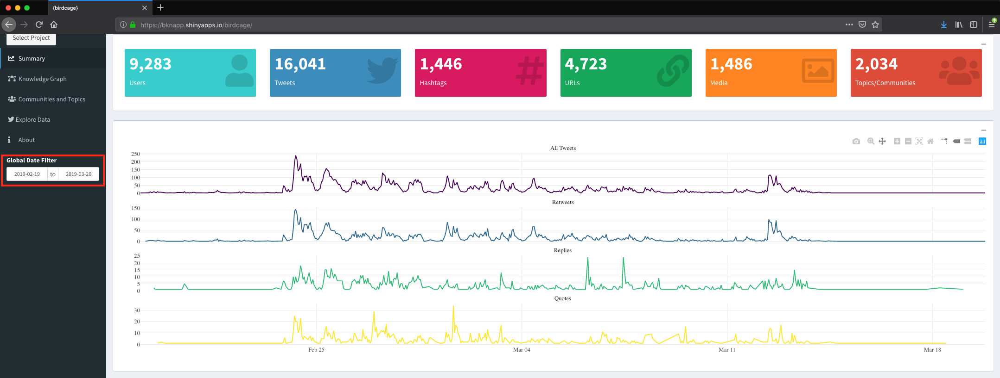
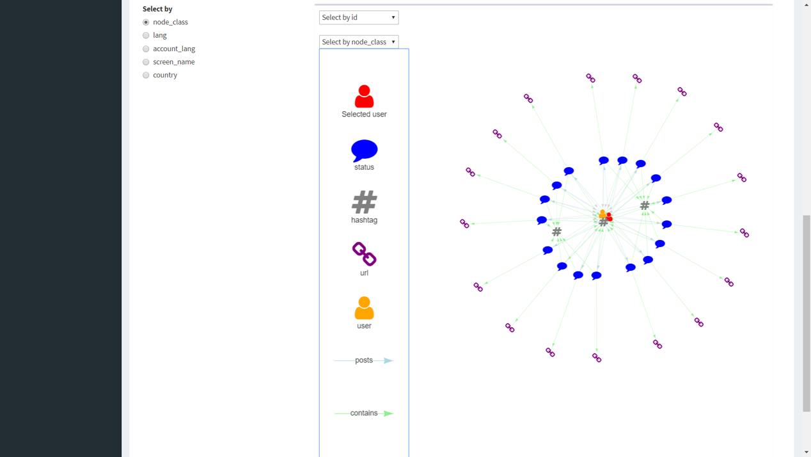

## Background

The purpose of this document is provide a general introduction to the Twitter analysis tool, **{birdcage}**. Under the sponsorship of CTTSO, the CORE Lab developed this custom tool to improve efficiency in the analysis of the social media information environment.

**{birdcage}** is an open source analytic tool that enables users to search, explore, and analyze social media data efficiently. Based on practitioners’ feedback, this custom analytic tool offers *Summary*, *Knowledge Graph*, *Communities and Topics*, and *Explore Data* windows to facilitate descriptive, temporal, and relational analyses.

For demonstration purposes, we will start with the first window (i.e., *Summary*) and work through subsequent windows’ features. Users do not have to work in this manner, however. Each window offers different features that might be relevant to a specific project.

Please consider the following as you walk through this tutorial:
  
1. This tool is not designed to be an “enterprise” solution; the goal is to fill analytic gaps by integrating it with existing systems.
2. Though it can ingest data from existing systems that make their data available, the CORE Lab will continue to work on incorporating new data sources.

## Accessing the Tool and Selecting a Project
  
Upon accessing the app via the web browser, you will be presented with the *Select Project* window. As of the time of writing this tutorial, the app offers access to Twitter data of projects from an existing enterprise system, namely Pulse; however, the Lab is working on additional integration options. Note that when you select a project, it may take a few second to load.

  
## Global Date Filter
  
It is often useful to filter a data set based on a specific time frame.  The *Global Date Filter* permits analysts to interact with the data to observe trends during a specific period of time. For instance, we can see the data from this project range from February 19, 2019 through March 20, 2019. 
  

  
Two key features to keep in mind:
    
  1. The default date range is based on the date range in the underlying data. 
  2. The filter applies to all the subsequent windows. For example, a filter created in the *Summary* window will apply to the *Knowledge Graph* as well. 
  
  
## Summary Statistics
  
Once you have selected a data set and a date range using the *Global Date Filter*, the *Summary* window provides analysts with project aggregate statistics, including number of users, tweets, hashtags, URLs, media, and social network clusters. For instance, we can see that our data set in this example contains 9,283 users, 16,041 tweets, 1,446 hashtags, etc. 
  
Moreover, the *Summary* section offers interactive timelines that visualize reply, retweet, and quote activity over time. For example, we can see a spike in retweets on February 24th.
  

  
We can zoom into time frames of interest by drawing a box over the area. Note you can return to the global view by simply double, left-clicking on the timeline. 
  

  
Finally, the *Summary* section outlines a project's most active accounts, most common hashtags, and most common languages.

 

## Knowledge Graph

The inherent relational nature of social media means analysts have to consider how accounts and other entities of interest are embedded in larger social structures.  The *Knowledge Graph* is intended for users to do just that. You will see an interactive table that permits you to search for users, statuses (e.g., tweets), and entities (e.g., hashtag and URLs) of interest. 

In this example, we will select a user (note you can select multiple users or a combination of users, statuses, and hashtags) and locate the *Update Graph with Selected Rows* button to visualize and interact the user's network *two* steps out (i.e., direct and indirect connections).  
  

  
Once you have visualized an entity's (or multiple entities) network, you will see the legend and the *Select by* feature. The former describes the entity and relationship types on the graph whereas the latter permits you to set your interactive options. For instance, the default choice is *node_class*, which allows you to identify and highlight all hashtags, users, etc. Note you can always choose to search your graph by node Id with the *Select by Id* drop-down.  

Additionally, you can select any node of the graph to obtain attribute information. 

Finally, you can simply select *Clear User Rows* followed by *Update Graph with Selected Rows* to clear your graph (note you would select *Clear Status Rows* and/or *Clear Entity Rows* if your initial search focuses on tweets or other entities.)

 

## Communities and Topics

Similar to the *Knowledge Graph*, the *Communities and Topics* window allows analysts to search and filter users, statuses, and entities for network analysis. A major motivation in social network analysis of communication and information-based networks is to identify subgroups/clusters of nodes who interact relatively more frequently with one another than with other groups of entities. For instance, sets of nodes may cluster because they are speaking the same language, talking about the same topic(s), and/or have similar views or beliefs about an issue.  The goal of the *Communities and Topics* window is to use a "community-detection" algorithm to identify clusters for analysts so they can see the "surrounding" community containing users, tweets, and/or other entities of interest.[^1] 

Once you've identified and selected users, tweets, and/or entities of interest, you can select *Find Community* and a second table will appear below the first one. In this table you will be able to explore other users, tweets, and hashtags within your initial search node's cluster, such as the text of their tweets. As with the *Knowledge Graph*, you can simply select *Clear User Rows* followed by *Update Graph with Selected Rows* to clear your graph (Note you would select *Clear Status Rows* and/or *Clear Entity Rows* if your initial search focuses on tweets or other entities.)

## Explore Data

The purpose of this final window is to allow analysts to search their data in a tabular format. This capability, though it may seem straightforward, is incredibly useful because Excel cannot create filters and sort large data sets without freezing. 

Finally, the *About* window provides general information about this tool, including our sponsor and contact information. 

[^1]: We leverage the Louvain method for identifying clusters, see Blondel, Vincent D; Guillaume, Jean-Loup; Lambiotte, Renaud; Lefebvre, Etienne (9 October 2008). "Fast unfolding of communities in large networks". Journal of Statistical Mechanics: Theory and Experiment. 2008 (10): P10008.
